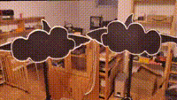
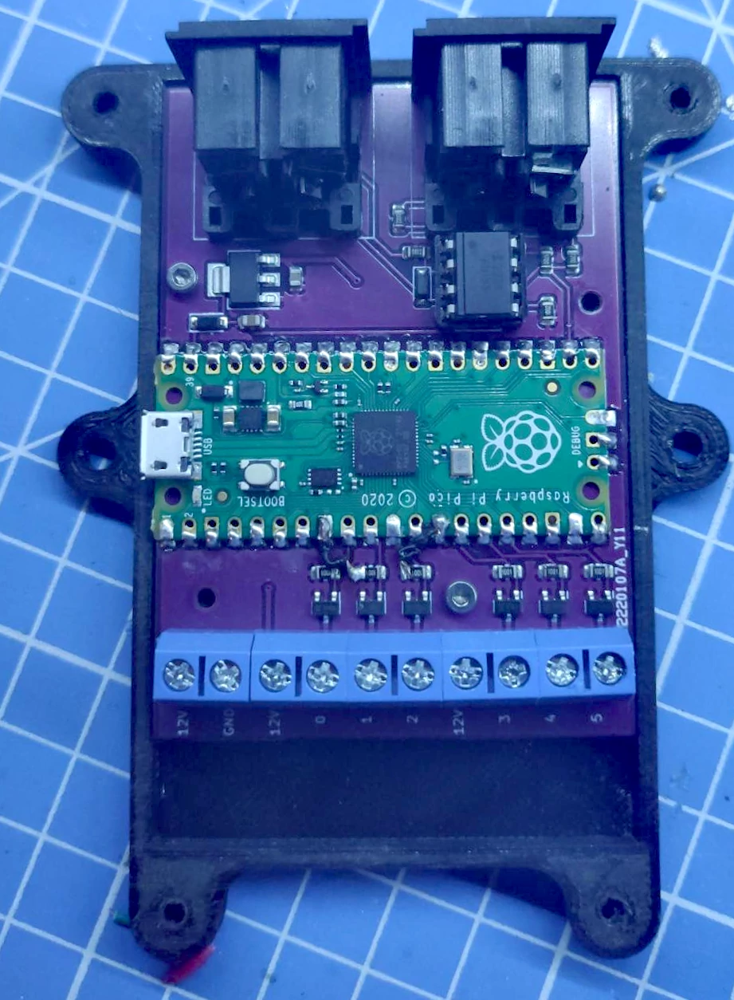

# PicoMidiLeds

Use a Pi Pico to control RGB Led strips via midi signals. 

## Features
- Control up to 6 Led channels with midi signals
- Daisy chain controllers together
- Note velocity controls Led brightness
- Dim all Led channels with the modulation control command
- Ignores note_off events so that the leds stay on when the midi track ends
- Set a default value for each channel
- Midi-in and midi-out via DIN-5
- Midi-in via usb
- Optocoupler protects pico from midi-in

## Rationale 

The band [Fliegende Haie](https://fliegendehaie.com) approached me to find a way to control multiple Led strips in accordance to their music tracks on stage.

They already had DIYed stage lighting consisting of two sharks in clouds. 
Each shark consists of two RGB-LED strips (one for the shark and one for the cloud).

Using existing stage lighting solutions (like [DMX](https://en.wikipedia.org/wiki/DMX512)) would mean a huge cost and steep learning curve. 
Since the band members already knew how to write midi tracks and had the hardware, it was the obvious choice to control the lighting via midi commands.

## Setup

### Firmware

- Install [Adafruit cricuit python](https://learn.adafruit.com/getting-started-with-raspberry-pi-pico-circuitpython/circuitpython) on the pico
- Download [library bundle](https://circuitpython.org/libraries)
- Copy adafruit midi to the Pico
- Rename PicoMidi.py to code.py
- Copy config.py and code.py to the Pico

### Config

Configurations should be made in the config.py file. See comments for explanation.

### PCB 

You can use the [Kicad project](board/pico-midi-leds/pico-midi-leds.kicad_pro) or just send the production files (board/pico-midi-leds/production/pico-midi-leds_2024-02-07_08-46-34) to a PCB-Manufacturerer. Or approach me since I have some populated boards left over.

Version 1 with bodgewires (already fixed):

### Enclosure

I added the stl files for an enclosure [Top](enclosure/PicoMidi%20-%20Lid.stl) and [Bottom](enclosure/PicoMidi%20-%20Bottom.stl) that can be used as enclosure.

## Todos
- Specify midi channel
- Enable midi out from usb (reqiures hardware change)
- Make ignoring note_off configurable

## Thanks

Thanks to [Fliegende Haie](https://fliegendehaie.com) for agreeing to make this project open source.